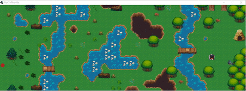

# Tower Defense - TP Jogos Digitais (CEFET-MG)

Jogo de Tower Defense desenvolvido em Java com [libGDX](https://libgdx.com/) 1.9.6 para a disciplina de Jogos Digitais do CEFET-MG.

O jogador posiciona torres no mapa para impedir que inimigos percorram o caminho até o objetivo. O jogo utiliza pathfinding com grafos e tiles para a movimentação dos inimigos.



## Pré-requisitos

- **Java JDK 8** (versões mais novas podem ter incompatibilidades com libGDX 1.9.6 e Gradle 2.4)

## Como rodar

### Linux / macOS

```bash
./gradlew desktop:run
```

### Windows

```bash
gradlew.bat desktop:run
```

> Na primeira execução o Gradle vai baixar as dependências automaticamente. Pode demorar um pouco.

## Estrutura do projeto

```
core/       → Código principal do jogo (lógica, renderização, pathfinding)
desktop/    → Launcher desktop (LWJGL)
docs/       → Imagens e documentação
```

## Controles

O jogo abre em uma janela de 1024x700. Interaja com o mouse para posicionar torres e defender o mapa.
